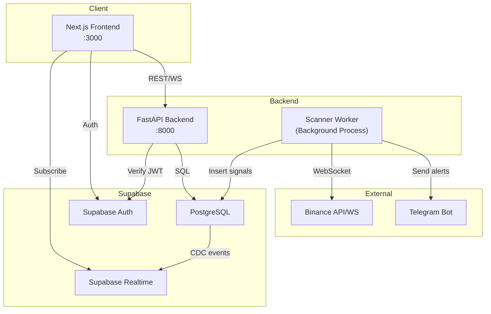
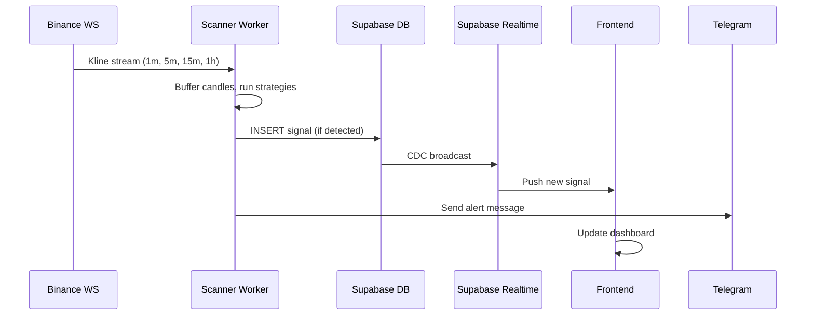
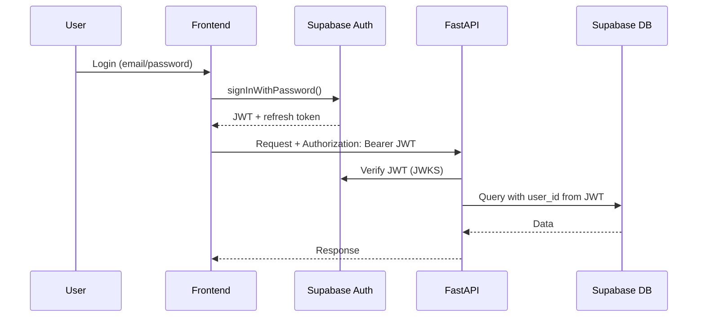

# Tram — Architecture Design

## 1. System Topology

## 2. Service Responsibilities

### Frontend (Next.js)
- **Auth flows** via Supabase client SDK
- **Dashboard rendering** with server components for initial load, client components for live data
- **Realtime subscriptions** to Supabase for signal/trade updates
- **Chart rendering** via Lightweight Charts
- **State management** — Zustand for UI state, TanStack Query for server state
- **Does NOT** call Binance directly — all market data flows through backend

### FastAPI Backend
- **API gateway** — validates Supabase JWTs, exposes REST endpoints
- **Trade management** — CRUD for journal entries, trades, watchlists
- **Analytics engine** — computes winrate, PnL, drawdown, equity curves
- **Strategy config** — CRUD for strategy parameters
- **WebSocket proxy** — streams live prices to frontend (optional, can use Supabase Realtime)
- **Does NOT** run the scanner loop — that's the worker's job

### Scanner Worker
- **Binance WebSocket consumer** — maintains persistent connections to kline streams
- **Strategy engine** — runs registered strategies against incoming candles
- **Signal producer** — writes detected signals to Supabase DB
- **Alert dispatcher** — sends Telegram notifications on new signals
- **Runs as separate process** — can be scaled independently
- **Shares codebase** with API (same Python package, different entrypoint)

### Supabase
- **PostgreSQL** — single source of truth for all persistent data
- **Auth** — handles user registration, login, JWT issuance
- **Realtime** — pushes DB changes to frontend via WebSocket (signals, trades)
- **RLS** — row-level security policies for multi-user readiness

## 3. Key Architectural Decisions

| Decision | Choice | Rationale |
|----------|--------|-----------|
| Scanner as separate process | Yes | Can crash/restart independently, different scaling profile |
| Shared Python package | Yes | Strategies, models, DB utils shared between API and worker — no duplication |
| Supabase Realtime over custom WS | Primary | Less infra to maintain; custom WS only for price streaming |
| Server Components for dashboard | Yes | Faster initial paint, SEO not critical but performance is |
| Zustand over Redux | Yes | Simpler API, sufficient for UI state (modals, filters, active tab) |
| TanStack Query for server state | Yes | Caching, deduplication, background refetch — perfect for trading data |
| Strategy pattern for signals | Yes | New strategies = new class, no modification to scanner core |

## 4. Data Flow: Signal Detection

## 5. Authentication Flow

## 6. Realtime Strategy

| Data Type | Method | Why |
|-----------|--------|-----|
| New signals | Supabase Realtime (postgres_changes) | Low latency, zero infra |
| Trade updates | Supabase Realtime | Same reason |
| Live prices | FastAPI WebSocket → Binance WS proxy | Supabase can't proxy external WS |
| Scanner status | Supabase Realtime (heartbeat row) | Simple health monitoring |

## 7. Scaling Bottlenecks & Mitigations

| Bottleneck | Risk Level | Mitigation |
|------------|-----------|------------|
| Scanner single process | Medium | Worker is stateless — can run multiple instances per symbol group |
| Binance WS rate limits | Medium | Batch subscribe, use combined streams (`/stream?streams=`) |
| DB write throughput (signals) | Low | Batch inserts, partitioned tables if needed later |
| Supabase Realtime fan-out | Low (single user) | Becomes relevant at ~1000 concurrent users |
| Analytics computation | Medium | Pre-aggregate daily stats, cache with TanStack Query |
| Frontend re-renders | Low | Zustand selectors, React.memo, virtualized lists |

## 8. Security Model

- **Supabase RLS** enabled on all tables from day one
- **JWT verification** on every FastAPI endpoint
- **API keys** stored in environment variables only
- **Binance API** — read-only keys, no trading permissions initially
- **CORS** — locked to frontend domain
- **Rate limiting** on FastAPI via slowapi
