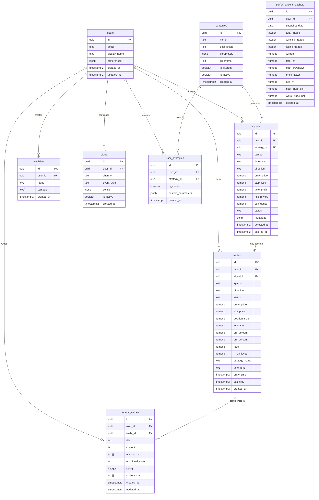

# Tram — Database Schema Design

## Entity Relationship Diagram



## Table Details

### `users` (extends Supabase auth.users)
```sql
CREATE TABLE public.users (
    id UUID PRIMARY KEY REFERENCES auth.users(id) ON DELETE CASCADE,
    email TEXT NOT NULL,
    display_name TEXT,
    preferences JSONB DEFAULT '{"theme": "dark", "default_timeframe": "1h", "default_leverage": 1}'::jsonb,
    created_at TIMESTAMPTZ DEFAULT now(),
    updated_at TIMESTAMPTZ DEFAULT now()
);
```
> Profile table linked 1:1 with Supabase auth. Keeps app data separate from auth internals.

### `strategies`
```sql
CREATE TABLE public.strategies (
    id UUID PRIMARY KEY DEFAULT gen_random_uuid(),
    name TEXT NOT NULL UNIQUE,
    description TEXT,
    parameters JSONB NOT NULL DEFAULT '{}'::jsonb,
    timeframe TEXT NOT NULL DEFAULT '1h',
    is_system BOOLEAN DEFAULT false,  -- system strategies vs user-created
    is_active BOOLEAN DEFAULT true,
    created_at TIMESTAMPTZ DEFAULT now()
);
```
> `is_system` differentiates built-in strategies from future user-created ones. `parameters` stores strategy-specific config (EMA periods, RSI thresholds, etc).

### `user_strategies` (junction table)
```sql
CREATE TABLE public.user_strategies (
    id UUID PRIMARY KEY DEFAULT gen_random_uuid(),
    user_id UUID NOT NULL REFERENCES public.users(id) ON DELETE CASCADE,
    strategy_id UUID NOT NULL REFERENCES public.strategies(id) ON DELETE CASCADE,
    is_enabled BOOLEAN DEFAULT true,
    custom_parameters JSONB DEFAULT '{}'::jsonb,  -- user overrides
    created_at TIMESTAMPTZ DEFAULT now(),
    UNIQUE(user_id, strategy_id)
);
```

### `signals`
```sql
CREATE TABLE public.signals (
    id UUID PRIMARY KEY DEFAULT gen_random_uuid(),
    user_id UUID REFERENCES public.users(id) ON DELETE SET NULL,
    strategy_id UUID NOT NULL REFERENCES public.strategies(id),
    symbol TEXT NOT NULL,
    timeframe TEXT NOT NULL,
    direction TEXT NOT NULL CHECK (direction IN ('long', 'short')),
    entry_price NUMERIC NOT NULL,
    stop_loss NUMERIC NOT NULL,
    take_profit NUMERIC NOT NULL,
    risk_reward NUMERIC GENERATED ALWAYS AS (
        CASE WHEN entry_price = stop_loss THEN 0
             WHEN direction = 'long' THEN (take_profit - entry_price) / NULLIF(entry_price - stop_loss, 0)
             ELSE (entry_price - take_profit) / NULLIF(stop_loss - entry_price, 0)
        END
    ) STORED,
    confidence NUMERIC DEFAULT 0 CHECK (confidence >= 0 AND confidence <= 100),
    status TEXT DEFAULT 'active' CHECK (status IN ('active', 'triggered', 'expired', 'cancelled')),
    metadata JSONB DEFAULT '{}'::jsonb,
    detected_at TIMESTAMPTZ DEFAULT now(),
    expires_at TIMESTAMPTZ DEFAULT now() + INTERVAL '24 hours'
);

CREATE INDEX idx_signals_symbol ON public.signals(symbol);
CREATE INDEX idx_signals_status ON public.signals(status);
CREATE INDEX idx_signals_detected ON public.signals(detected_at DESC);
CREATE INDEX idx_signals_user ON public.signals(user_id);
```
> `risk_reward` is a generated column — always consistent, zero maintenance. `metadata` stores variable data like indicator values at detection time.

### `trades`
```sql
CREATE TABLE public.trades (
    id UUID PRIMARY KEY DEFAULT gen_random_uuid(),
    user_id UUID NOT NULL REFERENCES public.users(id) ON DELETE CASCADE,
    signal_id UUID REFERENCES public.signals(id) ON DELETE SET NULL,
    symbol TEXT NOT NULL,
    direction TEXT NOT NULL CHECK (direction IN ('long', 'short')),
    status TEXT DEFAULT 'open' CHECK (status IN ('open', 'closed', 'cancelled')),
    entry_price NUMERIC NOT NULL,
    exit_price NUMERIC,
    position_size NUMERIC NOT NULL DEFAULT 0,
    leverage NUMERIC DEFAULT 1,
    pnl_amount NUMERIC DEFAULT 0,
    pnl_percent NUMERIC DEFAULT 0,
    fees NUMERIC DEFAULT 0,
    rr_achieved NUMERIC DEFAULT 0,
    strategy_name TEXT,
    timeframe TEXT,
    entry_time TIMESTAMPTZ DEFAULT now(),
    exit_time TIMESTAMPTZ,
    created_at TIMESTAMPTZ DEFAULT now()
);

CREATE INDEX idx_trades_user ON public.trades(user_id);
CREATE INDEX idx_trades_status ON public.trades(status);
CREATE INDEX idx_trades_symbol ON public.trades(symbol);
CREATE INDEX idx_trades_entry_time ON public.trades(entry_time DESC);
```

### `journal_entries`
```sql
CREATE TABLE public.journal_entries (
    id UUID PRIMARY KEY DEFAULT gen_random_uuid(),
    user_id UUID NOT NULL REFERENCES public.users(id) ON DELETE CASCADE,
    trade_id UUID REFERENCES public.trades(id) ON DELETE SET NULL,
    title TEXT,
    content TEXT,
    mistake_tags TEXT[] DEFAULT '{}',
    emotional_state TEXT CHECK (emotional_state IN ('calm', 'confident', 'anxious', 'fearful', 'greedy', 'frustrated', 'neutral')),
    rating INTEGER CHECK (rating >= 1 AND rating <= 5),
    screenshots TEXT[] DEFAULT '{}',
    created_at TIMESTAMPTZ DEFAULT now(),
    updated_at TIMESTAMPTZ DEFAULT now()
);

CREATE INDEX idx_journal_user ON public.journal_entries(user_id);
CREATE INDEX idx_journal_trade ON public.journal_entries(trade_id);
```

### `watchlists`
```sql
CREATE TABLE public.watchlists (
    id UUID PRIMARY KEY DEFAULT gen_random_uuid(),
    user_id UUID NOT NULL REFERENCES public.users(id) ON DELETE CASCADE,
    name TEXT NOT NULL,
    symbols TEXT[] NOT NULL DEFAULT '{}',
    created_at TIMESTAMPTZ DEFAULT now(),
    UNIQUE(user_id, name)
);
```

### `alerts`
```sql
CREATE TABLE public.alerts (
    id UUID PRIMARY KEY DEFAULT gen_random_uuid(),
    user_id UUID NOT NULL REFERENCES public.users(id) ON DELETE CASCADE,
    channel TEXT NOT NULL CHECK (channel IN ('telegram', 'discord', 'email')),
    event_type TEXT NOT NULL CHECK (event_type IN ('new_signal', 'trade_closed', 'price_alert')),
    config JSONB DEFAULT '{}'::jsonb,  -- channel-specific: chat_id, webhook_url, etc.
    is_active BOOLEAN DEFAULT true,
    created_at TIMESTAMPTZ DEFAULT now()
);
```

### `performance_snapshots` (daily aggregation)
```sql
CREATE TABLE public.performance_snapshots (
    id UUID PRIMARY KEY DEFAULT gen_random_uuid(),
    user_id UUID NOT NULL REFERENCES public.users(id) ON DELETE CASCADE,
    snapshot_date DATE NOT NULL,
    total_trades INTEGER DEFAULT 0,
    winning_trades INTEGER DEFAULT 0,
    losing_trades INTEGER DEFAULT 0,
    winrate NUMERIC DEFAULT 0,
    total_pnl NUMERIC DEFAULT 0,
    max_drawdown NUMERIC DEFAULT 0,
    profit_factor NUMERIC DEFAULT 0,
    avg_rr NUMERIC DEFAULT 0,
    best_trade_pnl NUMERIC DEFAULT 0,
    worst_trade_pnl NUMERIC DEFAULT 0,
    created_at TIMESTAMPTZ DEFAULT now(),
    UNIQUE(user_id, snapshot_date)
);

CREATE INDEX idx_perf_user_date ON public.performance_snapshots(user_id, snapshot_date DESC);
```
> Pre-aggregated daily stats. Avoids expensive full-table scans for analytics. Computed nightly or on trade close.

## RLS Policy Strategy

All tables have RLS enabled. Single-user now, multi-user ready:

```sql
-- Pattern applied to every user-owned table:
ALTER TABLE public.trades ENABLE ROW LEVEL SECURITY;

CREATE POLICY "Users can view own trades"
    ON public.trades FOR SELECT
    USING (auth.uid() = user_id);

CREATE POLICY "Users can insert own trades"
    ON public.trades FOR INSERT
    WITH CHECK (auth.uid() = user_id);

CREATE POLICY "Users can update own trades"
    ON public.trades FOR UPDATE
    USING (auth.uid() = user_id);

CREATE POLICY "Users can delete own trades"
    ON public.trades FOR DELETE
    USING (auth.uid() = user_id);
```

> `strategies` table: system strategies readable by all, user strategies scoped by `user_strategies` join.

## Realtime Subscriptions

Enable realtime on key tables:
```sql
ALTER PUBLICATION supabase_realtime ADD TABLE public.signals;
ALTER PUBLICATION supabase_realtime ADD TABLE public.trades;
```

Frontend subscribes to `INSERT` on `signals` and `UPDATE` on `trades` for live dashboard updates.
